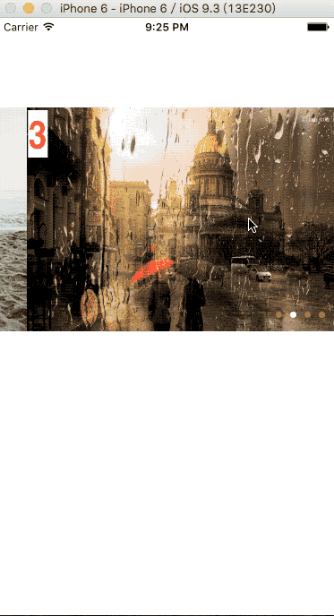

##图片轮播器 -- 支持倒序无限拖动

	如果你喜欢,请帮忙 star 非常感谢大神们的支持
	
###效果图


	
###更新日志
    2016-9-6 增加网络图片支持
    2016-9-5 重要更新:修复一个重大 bug ,该 bug 影响快速拖拽效果.
	2016-9-3 发布第一个版本

###特性

- 支持设置间隔时间
- 支持设置拖动后再次启动循环的间隔时间
- 支持正/倒序无限循环
- 支持图片的点击事件监听
- 其他......

###用法
直接把`WZCImagePlayView` 文件夹拖拽到你的项目中,并引入头文件 `WZCImagePlayView.h` 即可
 	
###调用方法
````objc
@interface WZCImagePlayView : UIView

/** brief: 间隔时间 (单位 s)*/
@property (nonatomic,assign) NSTimeInterval wzc_intervalTime; // <- default is 3

/** brief:用户拖拽后重启定时器的时间 */
@property (nonatomic,assign)  NSTimeInterval wzc_resetTime;  // <- default is 10

/** brief:imageView content Mode*/
@property (nonatomic,assign) UIViewContentMode wzc_imageViewContentMode; // <- default is UIViewContentModeScaleAspectFit

/** brief:pageControl */
@property (nonatomic,assign) UIPageControl *wzc_pageControl;

/** brief: 图片点击后的事件代理 */
@property (nonatomic,assign) id<WZCImagePlayViewDelegate> wzc_image_delegate;

/** brief: 唯一仅有的构建方法 */

- (instancetype)initWithFrame:(CGRect)frame images:(NSArray <UIImage *>*)images;

- (instancetype)initWithFrame:(CGRect)frame imagesUrlString:(NSArray <NSString *>*)imageUrlStrings placeholderImage:(UIImage *)placeholderImage;

#pragma mark - 下面的代码一定要调用,否则无法实现图片显示及轮播
/** 开始轮播 */
- (void)wzc_imagesBeginWorking;

@end

````

###使用示例

1.构造轮播器
````objc 
WZCImagePlayView *sv = [[WZCImagePlayView alloc]initWithFrame:
                    CGRectMake(0, 100, self.view.frame.size.width, 250) images:self.images];
````
或者

````objc

    WZCImagePlayView *sv = [[WZCImagePlayView alloc]initWithFrame:
                            CGRectMake(0, 100, self.view.frame.size.width, 250) imagesUrlString:@[@"http://img15.3lian.com/2015/f1/111/d/21.jpg",
                                @"http://img542.ph.126.net/628N3hbbFOq9uQcDTcPkMg==/2657968205079899331.jpg",
                                @"http://i3.s1.dpfile.com/pc/wed/cc16550a87068ad57789a07eee29c54e%28640c480%29/thumb.jpg",
                                @"http://i3.s1.dpfile.com/pc/wed/beace58b60543e50e1e7e7d3a8d1d68c%28640c480%29/thumb.jpg",] 
                                placeholderImage:[UIImage imageNamed:@"image_01.png"]];
````
2.设置参数

````objc

    sv.wzc_image_delegate = self;
    sv.wzc_intervalTime = 1.5;
    sv.wzc_resetTime = 3;
    sv.wzc_pageControl.currentPageIndicatorTintColor = [UIColor whiteColor];

````
3.添加到 view 并启动轮播器

````objc

[self.view addSubview:sv];
[sv wzc_imagesBeginWorking];

````

###作者的话

如果你有很好的建议或者发现了 bug 请及时 issues 我, 或者直接发邮件给我: voisen@icloud.com ,欢迎批评指正
